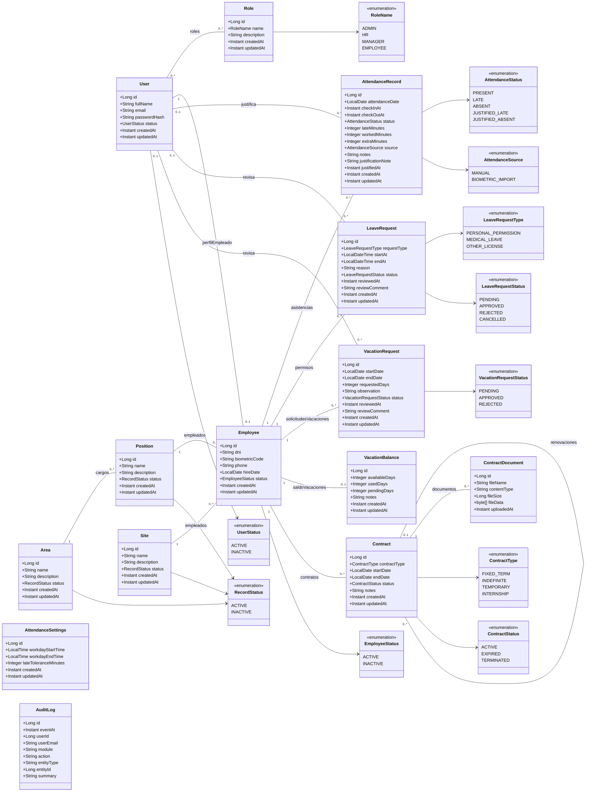

# Diagrama de clases real

Este diagrama representa las entidades JPA actuales del backend y sus relaciones principales. No incluye controllers, services, repositories ni DTOs.

## Notas

- `AuditLog` no tiene una relacion JPA directa con `User`; guarda `userId` y `userEmail`.
- `AttendanceSettings` no se relaciona directamente con otra entidad; funciona como configuracion global de asistencia.
- La relacion entre `User` y `Role` se persiste mediante la tabla intermedia `user_roles`.
- `Contract.previousContract` modela renovaciones o continuidad entre contratos.
